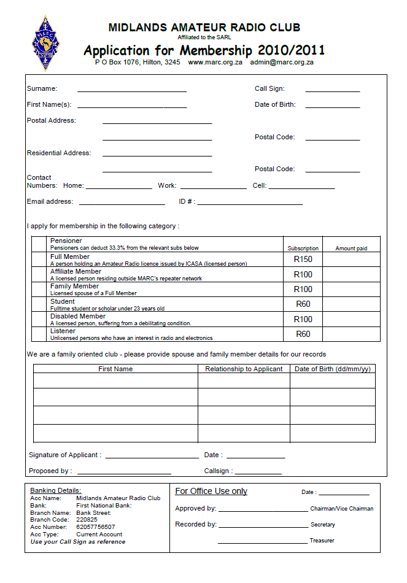

# Application Forms

Every year the club creates a new *application form* with our updated club fees.

Please browse [this folder](https://github.com/Midlands-Amateur-Radio-Club/Application_Forms/tree/main/Application_Forms) to see a list of the application forms and fill in the latest form according to the year.

*E.G* if the year is **2020** then fill in the form that contains the year **2020**.

Next after you have completed the form please send a *photocopy* of the form and your **Ham Radio License** to: koosmdmm@gmail.com

--
